# Design Document: LearnIQ

## Overview

LearnIQ is a cloud-native AI-powered educational platform that transforms failed code submissions into personalized learning opportunities. The system employs a microservices architecture on AWS, utilizing serverless technologies for elastic scalability and cost optimization. The platform focuses on identifying conceptual gaps in programming understanding rather than simply debugging code, providing learners with targeted micro-lessons that address fundamental misunderstandings.

The system serves three primary user groups: learners (students), educators (instructors and administrators), and institutions (universities and government programs). By analyzing failed code submissions through advanced AI techniques, LearnIQ creates personalized learning paths that adapt to individual learner needs and progress.

## Architecture

### High-Level Architecture

The system follows a serverless microservices architecture pattern, leveraging AWS managed services for scalability, reliability, and cost-effectiveness. The architecture is designed around event-driven patterns with loose coupling between components.

The diagram above illustrates the core data flow for the LearnIQ platform:

**Data Flow Process:**
1. **Code Submission**: Learner submits failed code through web interface or LMS integration
2. **API Routing**: AWS API Gateway routes the request to the Code Submission Lambda function
3. **Code Storage**: Raw code files are stored in Amazon S3 for persistence and analysis
4. **Metadata Storage**: Submission metadata and learner information stored in DynamoDB
5. **Analysis Trigger**: Code Submission function triggers the AI Analysis Lambda function
6. **AI Processing**: Analysis function sends code to Amazon Bedrock for conceptual gap identification
7. **Concept Identification**: Bedrock returns identified programming concepts and misunderstandings
8. **Analysis Storage**: Analysis results and conceptual gaps stored in DynamoDB
9. **Content Request**: Analysis function triggers Content Generation Lambda function
10. **Lesson Generation**: Content Generation function uses Bedrock to create personalized micro-lessons
11. **Content Return**: Bedrock returns generated educational content and exercises
12. **Lesson Storage**: Generated lessons and media assets stored in Amazon S3
13. **Path Update**: Learning path and progress data updated in DynamoDB
14. **Learner Notification**: API Gateway notifies learner of available lessons
15. **Content Delivery**: Personalized micro-lessons delivered to learner interface

This architecture ensures scalable, real-time processing of code submissions while maintaining separation of concerns between analysis, content generation, and data storage.

```mermaid
graph TB
    subgraph "Client Layer"
        LEARNER[👤 Learner<br/>Web/LMS Interface]
    end
    
    subgraph "AWS API Gateway"
        APIGW[🌐 API Gateway<br/>REST API Endpoints]
    end
    
    subgraph "AWS Lambda Functions"
        SUBMIT[⚡ Code Submission<br/>Lambda Function]
        ANALYZE[🧠 AI Analysis<br/>Lambda Function]
        CONTENT[📚 Content Generation<br/>Lambda Function]
    end
    
    subgraph "AI Services"
        BEDROCK[🤖 Amazon Bedrock<br/>Claude/GPT Models<br/>AI Reasoning & Content]
    end
    
    subgraph "Data Storage"
        DYNAMO[🗄️ DynamoDB<br/>Learner Data<br/>Learning Paths<br/>Progress Tracking]
        S3[📦 Amazon S3<br/>Code Submissions<br/>Lesson Content<br/>Media Assets]
    end
    
    %% Data Flow Connections
    LEARNER -->|1. Submit Failed Code| APIGW
    APIGW -->|2. Route Request| SUBMIT
    SUBMIT -->|3. Store Code| S3
    SUBMIT -->|4. Save Metadata| DYNAMO
    SUBMIT -->|5. Trigger Analysis| ANALYZE
    
    ANALYZE -->|6. Process Code| BEDROCK
    BEDROCK -->|7. Identify Concepts| ANALYZE
    ANALYZE -->|8. Store Analysis| DYNAMO
    ANALYZE -->|9. Request Content| CONTENT
    
    CONTENT -->|10. Generate Lessons| BEDROCK
    BEDROCK -->|11. Return Content| CONTENT
    CONTENT -->|12. Store Lessons| S3
    CONTENT -->|13. Update Path| DYNAMO
    CONTENT -->|14. Notify Learner| APIGW
    APIGW -->|15. Deliver Lessons| LEARNER
    
    %% Styling
    classDef client fill:#e1f5fe
    classDef aws fill:#ff9800
    classDef lambda fill:#4caf50
    classDef ai fill:#9c27b0
    classDef storage fill:#2196f3
    
    class LEARNER client
    class APIGW aws
    class SUBMIT,ANALYZE,CONTENT lambda
    class BEDROCK ai
    class DYNAMO,S3 storage
```



### Core Services Architecture

**Code Submission Service**: Handles code uploads, validates submissions, and triggers analysis workflows. Implemented as AWS Lambda functions with API Gateway integration.

**AI Analysis Service**: Processes code submissions to identify conceptual gaps using multiple AI models. Utilizes Amazon Bedrock for large language model capabilities and custom SageMaker models for specialized code analysis.

**Content Generation Service**: Creates personalized micro-lessons based on identified conceptual gaps. Leverages Amazon Bedrock for content generation with educational best practices embedded in prompts.

**Learning Path Service**: Manages personalized learning sequences, tracks progress, and adapts paths based on learner performance. Maintains state in DynamoDB with real-time updates.

**Analytics Service**: Provides insights for educators and administrators, tracking learning outcomes and system effectiveness. Uses OpenSearch for complex queries and real-time dashboards.

## Components and Interfaces

### Code Submission Component

**Purpose**: Manages the intake and initial processing of learner code submissions.

**Key Interfaces**:
- `POST /api/v1/submissions` - Submit code for analysis
- `GET /api/v1/submissions/{id}` - Retrieve submission status
- `GET /api/v1/submissions/{id}/results` - Get analysis results

**Implementation**: AWS Lambda function triggered by API Gateway, with submissions stored in S3 and metadata in DynamoDB. Supports multiple programming languages through language-specific parsers.

### AI Analysis Engine

**Purpose**: Identifies conceptual gaps and programming misunderstandings in submitted code.

**Key Components**:
- **Syntax Analyzer**: Detects compilation and syntax errors
- **Logic Analyzer**: Identifies logical flaws and algorithmic issues  
- **Concept Mapper**: Maps errors to fundamental programming concepts
- **Gap Identifier**: Determines specific conceptual misunderstandings

**AI Models Used**:
- Amazon Bedrock (Claude/GPT models) for natural language understanding of code and concept inference through LLM reasoning
- Custom SageMaker models trained on educational programming datasets
- Static analysis combined with prompt-guided interpretation for comprehensive code understanding

### Content Generation Engine

**Purpose**: Creates personalized micro-lessons targeting identified conceptual gaps.

**Key Features**:
- Adaptive content complexity based on learner level
- Multi-modal content (text, code examples, interactive exercises)
- Language-specific examples and explanations
- Pedagogically sound lesson structure

**Content Types**:
- Conceptual explanations with visual aids
- Interactive code examples with step-by-step walkthroughs
- Practice exercises with immediate feedback
- Assessment questions to verify understanding

### Learning Path Manager

**Purpose**: Orchestrates personalized learning sequences and tracks progress.

**Key Algorithms**:
- Prerequisite dependency resolution for concept ordering
- Adaptive sequencing based on learner performance
- Spaced repetition for concept reinforcement
- Mastery-based progression tracking

### Integration Layer

**LMS Integration**: RESTful APIs supporting Canvas, Moodle, and Blackboard integration with OAuth 2.0 authentication and grade passback capabilities.

**SSO Integration**: SAML 2.0 and OpenID Connect support through AWS Cognito for institutional authentication systems.

**Analytics Integration**: Real-time data streaming to institutional analytics platforms via secure APIs.

## Data Models

### Core Data Entities

```typescript
interface CodeSubmission {
  id: string;
  learnerId: string;
  institutionId: string;
  language: ProgrammingLanguage;
  code: string;
  submittedAt: Date;
  status: SubmissionStatus;
  analysisResults?: AnalysisResult[];
}

interface AnalysisResult {
  id: string;
  submissionId: string;
  conceptualGaps: ConceptualGap[];
  errorTypes: ErrorType[];
  complexity: ComplexityLevel;
  confidence: number;
  analyzedAt: Date;
}

interface ConceptualGap {
  id: string;
  concept: ProgrammingConcept;
  severity: GapSeverity;
  description: string;
  prerequisites: string[];
  relatedConcepts: string[];
}

interface MicroLesson {
  id: string;
  conceptId: string;
  title: string;
  content: LessonContent;
  difficulty: DifficultyLevel;
  estimatedDuration: number;
  interactiveElements: InteractiveElement[];
  assessments: Assessment[];
}

interface LearningPath {
  id: string;
  learnerId: string;
  lessons: LearningPathItem[];
  currentPosition: number;
  progress: ProgressMetrics;
  adaptations: PathAdaptation[];
}

interface Learner {
  id: string;
  institutionId: string;
  profile: LearnerProfile;
  preferences: LearningPreferences;
  progress: LearningProgress;
  achievements: Achievement[];
}
```

### Data Storage Strategy

**DynamoDB Tables**:
- `Learners` - Learner profiles and preferences (partition key: learnerId)
- `Submissions` - Code submissions and metadata (partition key: learnerId, sort key: submissionId)
- `AnalysisResults` - AI analysis outcomes (partition key: submissionId)
- `LearningPaths` - Personalized learning sequences (partition key: learnerId)
- `MicroLessons` - Generated educational content (partition key: conceptId)

**S3 Buckets**:
- `code-submissions` - Raw code files and large submission data
- `lesson-content` - Generated micro-lesson content and media
- `analytics-data` - Processed analytics data for reporting

**OpenSearch Indices**:
- `learner-analytics` - Searchable learner progress and outcome data
- `content-effectiveness` - Micro-lesson performance metrics
- `institutional-insights` - Aggregated institutional analytics

## Correctness Properties

*A property is a characteristic or behavior that should hold true across all valid executions of a system—essentially, a formal statement about what the system should do. Properties serve as the bridge between human-readable specifications and machine-verifiable correctness guarantees.*

Before defining the correctness properties, I need to analyze the acceptance criteria from the requirements to determine which ones are testable as properties.

### Core System Properties

**Property 1: Multi-language Code Analysis**
*For any* supported programming language (Python, Java, JavaScript, C++, C), when code is submitted, the AI_Analyzer should correctly identify compilation errors, runtime errors, logical errors, and distinguish between syntax errors and conceptual misunderstandings specific to that language.
**Validates: Requirements 1.1, 1.2, 1.3, 5.1, 5.2**

**Property 2: Conceptual Gap Identification and Categorization**
*For any* code submission with programming concept misunderstandings, the System should identify specific misunderstood concepts, categorize them by programming domain, and prioritize them based on learning impact and prerequisite relationships.
**Validates: Requirements 2.1, 2.2, 2.5**

**Property 3: Personalized Content Generation**
*For any* identified conceptual gap, the Content_Generator should create micro-lessons that target the specific gap, adapt complexity to the learner's skill level, include interactive examples and exercises, and follow pedagogical best practices.
**Validates: Requirements 3.1, 3.2, 3.3, 3.4**

**Property 4: Learning Path Construction and Adaptation**
*For any* learner with multiple conceptual gaps, the System should create a personalized learning path that considers prerequisite relationships, updates based on progress, adapts to newly identified gaps, and advances learners to more complex concepts upon demonstrating mastery.
**Validates: Requirements 4.1, 4.2, 4.3, 4.4, 4.5**

**Property 5: Data Persistence and Tracking**
*For any* code submission and analysis, the System should store the submission with associated metadata, track learning progression over time across multiple submissions, and maintain retrievable historical data.
**Validates: Requirements 1.4, 1.5**

**Property 6: Pattern Recognition Across Learners**
*For any* set of learners with similar conceptual gaps, the System should detect recurring issues for individual learners and identify common institutional learning challenges across multiple learners.
**Validates: Requirements 2.3, 2.4**

**Property 7: Language-Specific Content Adaptation**
*For any* micro-lesson generation, when the learner has a chosen programming language, the Content_Generator should provide examples in that language, and for universal concepts, should explain them in language-agnostic terms with language-specific examples.
**Validates: Requirements 5.3, 5.4**

**Property 8: Caching and Performance Optimization**
*For any* frequently requested micro-lesson, repeated requests should be served from cache, improving response times for identical content requests.
**Validates: Requirements 6.4**

**Property 9: AI Explainability and Transparency**
*For any* conceptual gap identification or educational recommendation, the System should provide explainable reasoning for the AI's decisions and be transparent about the decision-making process.
**Validates: Requirements 7.1, 7.4**

**Property 10: Bias Prevention and Inclusive Content**
*For any* generated micro-lesson content, the Content_Generator should avoid biased language, ensure inclusive examples, and when potential bias is detected in outcomes, alert administrators with mitigation options.
**Validates: Requirements 7.2, 7.5**

**Property 11: Privacy Protection**
*For any* learner data processing, the System should implement privacy protection measures, ensuring sensitive data is properly protected and encrypted.
**Validates: Requirements 7.3**

**Property 12: Integration and Data Synchronization**
*For any* learner progress update, when integrated with institutional systems, the System should sync progress data with grade books and provide analytics on learner progress and common gaps.
**Validates: Requirements 8.2, 8.3**

**Property 13: Notification and Engagement Tracking**
*For any* completed analysis, the System should notify learners of available micro-lessons, track completion and comprehension metrics when learners engage with content, and provide real-time dashboard updates showing learner progress.
**Validates: Requirements 9.2, 9.3, 9.4**

**Property 14: Trend Detection and Alerting**
*For any* emerging learning challenge trends, the System should alert educators and provide insights about detected patterns.
**Validates: Requirements 9.5**

**Property 15: Content Quality and Effectiveness Monitoring**
*For any* generated micro-lesson, the System should include assessment mechanisms to verify learner understanding, identify low-performing content for review, incorporate educator feedback to improve quality, and measure learning outcomes and content effectiveness.
**Validates: Requirements 10.1, 10.2, 10.3, 10.4, 10.5**

## Error Handling

### Error Classification and Recovery

**Submission Processing Errors**:
- Invalid code format: Return structured error with guidance for proper submission
- Unsupported language: Provide list of supported languages and migration suggestions
- File size limits: Implement chunking for large submissions or provide compression guidance
- Malformed requests: Return detailed validation errors with correction suggestions

**AI Analysis Failures**:
- Model timeout: Implement retry logic with exponential backoff, fallback to simpler analysis
- Confidence threshold not met: Flag for human review while providing partial results
- Resource exhaustion: Queue requests and provide estimated processing time
- Model unavailability: Gracefully degrade to cached similar analyses or basic error detection

**Content Generation Errors**:
- Template rendering failures: Fallback to basic lesson templates with manual review flags
- Inappropriate content detection: Implement content filtering with human oversight
- Personalization failures: Default to general content while logging for improvement
- Resource constraints: Implement content caching and lazy loading strategies

**Integration Failures**:
- LMS connectivity issues: Implement offline mode with sync when connection restored
- Authentication failures: Provide clear error messages and alternative authentication methods
- Data sync failures: Implement eventual consistency with conflict resolution
- Third-party service outages: Graceful degradation with user notification

### Monitoring and Alerting

**System Health Monitoring**:
- Real-time metrics for all critical system components
- Automated alerts for service degradation or failures
- Performance threshold monitoring with proactive scaling
- Data quality monitoring for AI model inputs and outputs

**Educational Effectiveness Monitoring**:
- Learning outcome tracking with statistical significance testing
- Content effectiveness metrics with A/B testing capabilities
- Bias detection monitoring with automated flagging
- User satisfaction tracking with feedback loop integration

## Testing Strategy

### Dual Testing Approach

The system employs both unit testing and property-based testing to ensure comprehensive coverage and correctness validation.

**Unit Testing Focus**:
- Specific examples demonstrating correct behavior for each component
- Edge cases and error conditions for all critical paths
- Integration points between microservices
- Authentication and authorization workflows
- LMS integration scenarios

**Property-Based Testing Focus**:
- Universal properties that hold across all valid inputs
- AI model behavior consistency across different code submissions
- Learning path generation correctness for various learner profiles
- Content generation quality across different conceptual gaps
- System scalability and performance characteristics

### Property-Based Testing Configuration

**Testing Framework**: The system uses Hypothesis for property-based testing of core algorithms and fast-check for frontend and API testing.

**Test Configuration**:
- Minimum 100 iterations per property test to ensure statistical significance
- Each property test references its corresponding design document property
- Tag format: **Feature: fail2learn-ai, Property {number}: {property_text}**
- Custom generators for educational domain objects (code submissions, learner profiles, conceptual gaps)

**Property Test Implementation Requirements**:
- Each correctness property must be implemented by a single property-based test
- Tests must generate realistic educational scenarios and code submissions
- AI model responses must be validated for consistency and educational value
- Learning progression must be tested across multiple simulated learner journeys

### Testing Data and Scenarios

**Synthetic Code Generation**:
- Automated generation of code samples with known conceptual errors
- Multi-language code corpus with varying complexity levels
- Realistic learner progression scenarios with diverse backgrounds
- Edge cases including malformed code, unusual error patterns, and boundary conditions

**Educational Scenario Testing**:
- Simulated classroom environments with multiple concurrent learners
- Various institutional settings (university, government programs, online courses)
- Different learning objectives and curriculum requirements
- Accessibility and inclusivity scenarios for diverse learner populations

The testing strategy ensures that LearnIQ maintains high educational effectiveness while scaling reliably across diverse institutional environments.